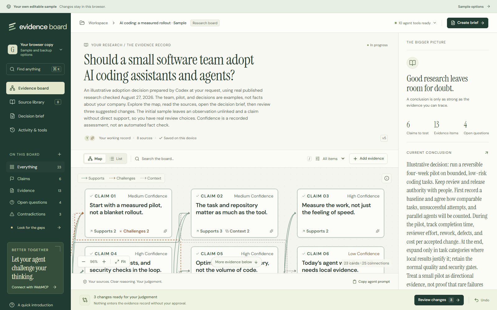

# Evidence Board

**Better evidence. Clearer decisions.** A research workspace for people and browser agents, with original sources, visible reasoning, and human approval of agent proposals.

## Try the sample

Open [Evidence Board](https://evidence-board-judging.fink692.chatgpt.site/) and choose **Open editable sample**, or [go directly to your sample](https://evidence-board-judging.fink692.chatgpt.site/?guest=1). No sign-in is required. Each browser profile gets an editable copy with eight published sources, 23 research cards, 25 connections, three unresolved conflicts, and three prepared review suggestions. The scenario and suggestions are illustrative; no results about a user's company are invented.

[Watch the 2:40 walkthrough](https://evidence-board-judging.fink692.chatgpt.site/walkthrough.html), with narration and captions. It shows real native WebMCP calls and selective review in the public app. Playwright drives the calls and review controls; no external language model participates.

Edits, pending proposals, review selections, activity, and undo history are saved on this device. They are not synced between devices or sent to the account API. Use **Sample options** to export a full backup or explicitly replace your copy. Anyone using the same browser profile may see it; clearing browser data removes it. Keep one editing tab open. Detected competing edits stop saving rather than silently replace the other copy.

Choose **Start your own research** to open the separate authenticated workspace at /?workspace=1. Sign in with ChatGPT and create a board around your own question. Account boards use private server storage, including pending proposals and undo history. Every API operation checks the signed-in owner; making the landing page public does not make account boards public.

## Research you can inspect

Add claims, sourced evidence, and open questions. Connect evidence as support, challenge, or context. Keep recorded source wording separate from your interpretation. **Check evidence** finds structural gaps, not verified truth. Preserve contradictions, write a conclusion, and export a cited Markdown brief.

A compatible browser agent can inspect accepted research and propose exact changes through ten native WebMCP tools. Review operations individually, edit wording, and accept only what belongs. No exposed tool can approve its own proposal. Undo restores accepted content while revision numbers remain monotonic.

There is no built-in model, automatic scraping, hidden summarization, or simulated agent conversation. The sample's prepared suggestions are labelled as sample contributions. Native tool registration means the browser exposes the API, not that an external model connected.

See [WebMCP contracts and verification](docs/webmcp-tools.md), [storage and privacy](docs/hosted-workspace.md), and [portable sample provenance](examples/README.md).

## Run locally

Requires Node.js 24 and pnpm 11.19.0.

~~~sh
pnpm install --frozen-lockfile
pnpm dev
~~~

Open **http://127.0.0.1:4173**. The landing page links to both modes. The sample works immediately at /?guest=1. Authenticated local workspaces use the Sites development sign-in simulator and SQLite under .local/. New account boards start empty. The guest sample is initialized from checked-in source, never copied from an owner's account. The portable JSON sample can also be imported as a separate account board.

On Windows, start.ps1 finds the bundled runtime if available. This directory is the standalone application root.

## Verify and build

~~~sh
pnpm typecheck
pnpm test
pnpm build
pnpm exec playwright install chromium
pnpm test:e2e
~~~

The tests cover domain rules, native adapter contracts, selective review, full-session persistence, real SQLite API round trips, owner isolation, stale saves, Unicode storage, recovery, guest storage failures, and source provenance. Browser tests exercise the current sample, review, manual editing, saved-session recovery, export, undo, keyboard/mobile access, and actual native WebMCP where available. Unsupported native builds are explicitly skipped; no API mock is installed in the page. Set EVIDENCE_BASE_URL to run the browser suite on your own hosted deployment using fresh isolated browser contexts.

A build emits browser assets in dist/client and the Sites Worker in dist/server/index.js. The Sites plugin packages binding metadata and Drizzle migrations. For schema changes, edit db/schema.ts, run pnpm db:generate, and inspect the migration. Production identity comes from Sites; there is no production local-auth bypass or application AI key.

The 21 MB walkthrough stays in the source repository for local use but is excluded from the Worker bundle. Production serves it from the `MEDIA` R2 binding at the same playback URL. On first use, the server copies only the fixed, public recording from a pinned GitHub commit after checking its exact length and SHA-256. Subsequent requests use R2, including byte ranges and cache validation. This is not an upload endpoint or an arbitrary URL proxy; no research data is sent to GitHub. See [Cloudflare's R2 API](https://developers.cloudflare.com/r2/api/workers/workers-api-reference/) for the underlying storage interface.

The public judging Site is separate from the original owner's private Site and database. .openai/hosting.json binds this checkout to the judging Site. Do not reuse that project ID for your own deployment. Deploy compiled output through Sites; never include local databases, environment files, credentials, or private boards.

## Submission and license

[Submission materials](submission/README.md) distinguish current assets from historical recordings. The original fictional library fixture remains useful test material but is not the current start experience. Do not present its older rehearsal video as the current application.

[MIT](LICENSE). Bundled fonts retain their [DM Sans](public/fonts/DM-Sans-OFL.txt) and [Instrument Serif](public/fonts/Instrument-Serif-OFL.txt) license notices.
