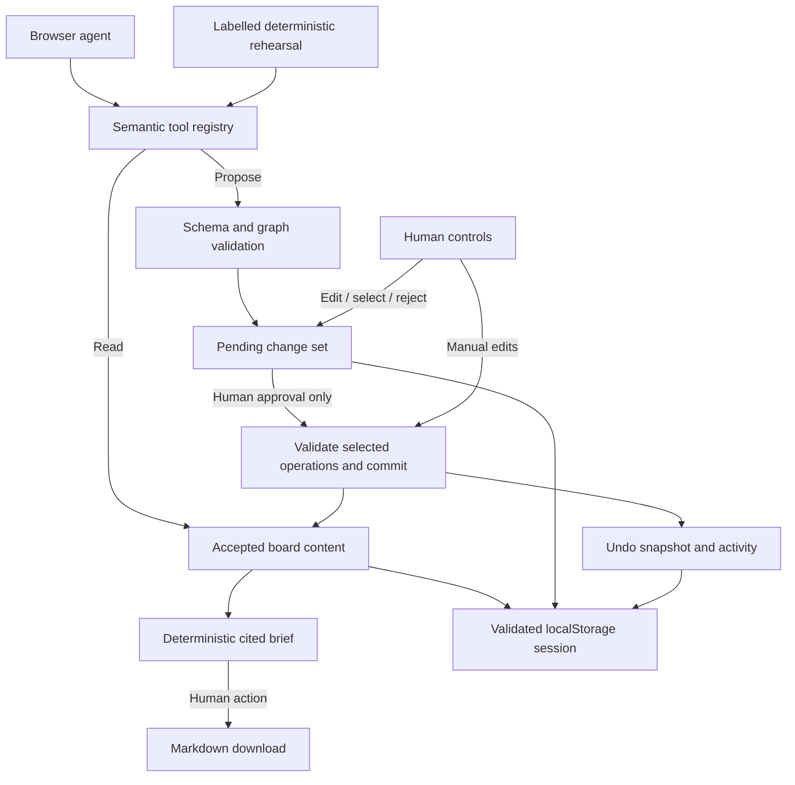

# Architecture

Evidence Board is a separate React, TypeScript, and Vite application inside `evidence-board/`. A static frontend is sufficient for the intended local workspace: there is no required model key, research-fetch service, account server, or database backend.

## One accepted record

`createBoardStore({ content?, storage? })` is framework-independent. The application uses its `boardStore` singleton through React’s `useSyncExternalStore`. `getState()` returns a cached, deeply frozen snapshot until an update; notifications are synchronous. View changes retain the same accepted-content reference and do not advance its revision.

## Modules

| Module | Responsibility |
| --- | --- |
| [`src/domain/types.ts`](../src/domain/types.ts) | Shared entities, operations, review state, and store interface |
| [`src/domain/validation.ts`](../src/domain/validation.ts) | Strict schemas, graph integrity, atomic operation simulation, safe JSON parsing |
| [`src/domain/serialization.ts`](../src/domain/serialization.ts) | Shared portable JSON format, serializer, and aggregate backup capacity |
| [`src/state/boardStore.ts`](../src/state/boardStore.ts) | Accepted revisions, proposal review, history, activity, persistence, import/export |
| [`src/domain/selectors.ts`](../src/domain/selectors.ts) | Shared node filtering, relationship lookup, and statistics |
| [`src/domain/brief.ts`](../src/domain/brief.ts) | Brief assembled exclusively from accepted content |
| [`src/data/seed.ts`](../src/data/seed.ts) | Fictional library fixture and empty-board factory |
| [`src/webmcp`](../src/webmcp) | Ten semantic tools, runtime schemas, native adapter, and rehearsal |
| [`src/components`](../src/components) | Map/list, inspector, review, sources, brief, activity, and human controls |

## Content and transactions

The graph contains claims, source-backed evidence, and open questions. Evidence links point from evidence to a claim with `supports`, `challenges`, or `context` stance and a written reason. A conflict names at least two existing nodes and has an explicit resolved flag. Sources are separate records so multiple nodes can cite the same material.

An accepted transaction validates each operation in order against an isolated copy, then commits once. This supports a new source/node followed by references to it. Forward references and missing selected dependencies are errors. Deleting a node removes incident links and removes it from conflicts; a conflict with fewer than two remaining nodes is removed. Source records remain available in the register.

Accepted revisions begin at 1 and increase after edits, approval, import, reset, starting empty, and Undo. A no-op human edit creates no revision. Undo restores the prior content, including provenance and relationships, but never decrements the revision number. This avoids accepting a proposal prepared before an intervening edit or Undo.

## Review state

A change set records its title, summary, base revision, operations, individual rationale, and selection. Its status is `pending`, `applied`, `rejected`, or `undone`.

Proposing, editing proposed wording, toggling selection, and rejecting proposals do not alter accepted content or its revision. Approval validates only the selected operations as one batch; deselected changes remain in review history but are not accepted. Other pending proposals become stale and are rejected when accepted content changes. An undone approval requires a new proposal before it can be applied again.

Creation provenance is assigned at the domain boundary: direct human-created records use `human`; approved assisted records use `agent`. Approval activity identifies the human action. Rehearsal invocation/proposal activity uses `demo`. These fields explain the workflow and are not cryptographic identity claims.

## Derived views and briefs

Map and structured list consume the same accepted nodes and filters. Focus is presentation state, not hidden evidence removal. Gaps are distinct open questions, unlinked evidence, and claims without supporting evidence. Conflict counts and the conflict filter include unresolved conflicts only; relationship inspection and the brief retain resolved conflict records too.

The brief generator receives only `BoardContent`, a revision, and a generation timestamp. It cannot inspect proposal history. It includes the human-authored or approved working conclusion, linked support/challenges/context, separate counterevidence, unlinked evidence, conflicts, open questions, and a source register. Every registered source receives an `[S#]` reference; unused sources are explicitly described as unattached rather than supporting a claim.

Briefs are cached per accepted revision and invalidated on content changes. Generating a brief creates a derived artifact, not a content revision. JSON exports include accepted content and metadata, excluding pending proposals, activity, and undo history. Neither generation nor JSON serialization itself downloads or publishes a file.

## Persistence and boundaries

The version-1 session stores content, revision, change sets, activity, and undo history. Presentation state and the cached brief are reconstructed rather than persisted. Explicit `content` bypasses hydration, and `storage: null` gives tests or callers an intentional memory-only store.

Domain limits are 250 nodes, 150 sources, 600 links, 150 conflicts, and 30 operations per batch. Titles allow 160 characters; evidence text and source excerpts allow 6,000. The shared serializer limits the complete formatted JSON backup to 5,000,000 characters, reserving room for the longest supported revision. Every accepted mutation, proposal preview, and import must fit this aggregate limit, so an accepted board remains reimportable even when individual collection limits have not been reached. Oversized changes fail before altering content or undo history. The import dialog additionally rejects files above 15 MB before decoding, allowing the maximum UTF-8 byte size of a valid character-limited export. The tool layer applies smaller request/output budgets documented in [the WebMCP contract](webmcp-tools.md).

History is bounded to 20 snapshots; proposal records to 40; activity to 120. Session serialization targets at most 4,500,000 characters and prunes oldest undo snapshots before reporting a storage error. Browser quotas can be smaller. Corrupt hydration or failed writes show a recoverable warning rather than preventing manual work. See [security and limitations](security.md) for localStorage privacy, lack of cross-tab coordination, and the limits of the audit trail.

## The library case

The seed contains three claims, eight evidence items, two questions, and eight fictional sources. `evidence_turnstile` starts unlinked. The rehearsal proposes its missing challenge to `claim_demand`, surfaces the survey/usage tension, and adds a research question. It neither rewrites the conclusion nor accepts its own work.

The case deliberately distinguishes general survey interest in later hours from demonstrated overnight use. Entry counts do not establish occupancy or unmet need; exam evening demand does not establish post-midnight demand; a comparable pilot does not establish this campus’s costs. An existing cost conflict makes the 31% staffing estimate and 18% contingency visible. The starting conclusion is a position to examine, not an inference guaranteed by the data.

## Verification

`src/domain/boardStore.test.ts` contains 58 passing checks covering the store and accepted-content boundary. The complete `pnpm test` run passed 110 tests on August 27, 2026; `pnpm typecheck` passed as well. Three focused browser regressions also passed for Unicode backup round trips, import size limits, and reuse of an imported source with ID `new`. The rehearsal and adapter unit tests are separate from proof of a live native browser/agent integration.
